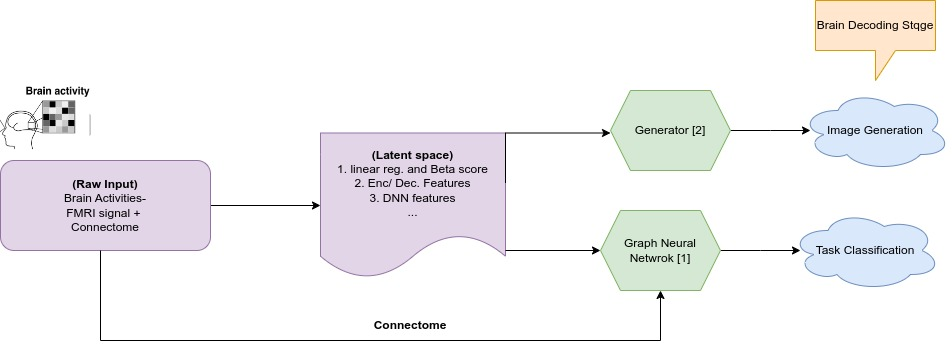
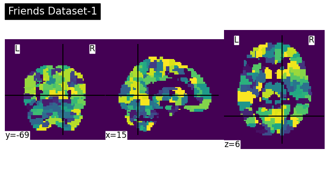
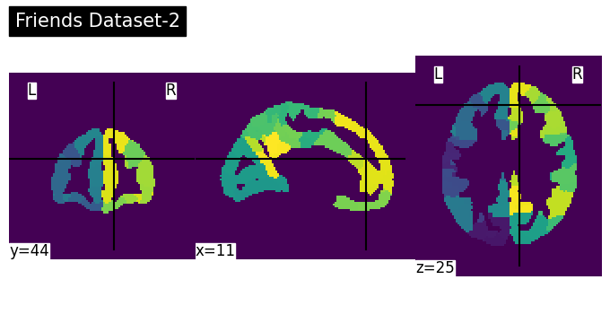

# BrHP_Arian

<a href="https://github.com/aarian">
   
    
   <b>My Avatar</b>
</a>

Hi! I am Arian. I am passionate about the intersection of Neuro and Computer Science.My interests normally revolves around Neuro AI, Neuroimaging. Specifically I want to explore machine/ deep learning algorithms on different type of data like FMRI and EEG. Currently, I am discovering different direction like disease classification, and brain graph structure learning. 

 Here is a bit about my background:
<ul>
   <li>
       I am a Ph.D. student in the Electrical and Computer Engineering Department at Concordia University, where I have been studying since September 2022.
   </li>
   <li>
       I received my MSc in Computer Engineering with a focus on Artificial Intelligence.
   </li>
   <li>
       I earned my BSc in Computer Engineering, specializing in Hardware.
   </li>
</ul>

I would like to express my gratitude for the inspiration and opportunities provided by the incredible organizers of the Brain Hack School.

# Project Title: Brain Decoding usign FMRI data and Graph Neural Netwroks

## Outline

<ul style="font-size: 20px;">
    <li>Problem Definition</li>
    <li>Datasets,Tools</li>
    <li>Deliverables</li>
</ul>

## Prior Works and Problem Definition
Adding image + two papers. 

## Datasets and tools
I would like to learn the following skills including: 

### Tools
- `nilearn` 
- `torch.geometric` 
- `Docker` (just playing with it to see how it works on Colab)

### Dataset
- `IUGM-preprocessed data`
- Two Examples: 

### Methods
- Graph Signal Processing
- Graph Neural Networks
- ChebyNet

## Deliverables of the Project
The deliverables of this project is: 
* Notebooks for community to use
* Github repository
* Training materials
* Data  

## References
- [1] Yu Zhang, Loïc Tetrel, Bertrand Thirion, Pierre Bellec, "Functional annotation of human cognitive states using deep graph convolution," _NeuroImage_, Volume 231, 2021, 117847, ISSN 1053-8119.

- [2] Shirakawa, K., Nagano, Y., Tanaka, M., Aoki, S. C., Majima, K., Muraki, Y., & Kamitani, Y. (2024). Spurious reconstruction from brain activity. arXiv preprint arXiv:2405.10078.

